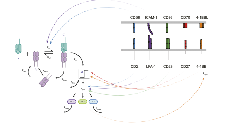

# T Cell Activation Mathematical Model
ODE-based Mathematical Model of T cell activation following antigen stimulation over time

This repository contains a mathematical model for T cell activation, implemented in Python using NumPy, SciPy, and Matplotlib. The model explores different scenarios, including variations with and without costimulatory signals.

## Table of Contents

- [Overview](#overview)
- [Usage](#usage)
- [Models](#models)
- [Parameters](#parameters)
- [Results](#results)
- [License](#license)

## Overview

The mathematical model simulates T cell activation under different conditions, considering the impact of engaging the costimulatory receptors: CD2, ICAM, CD28, CD27, and 4-1BB. The implemented models are based on ordinary differential equations (ODEs) to describe the dynamics of key variables over time. The schematic below indicates at which point each costimulatory receptor integrates into the T cell signalling pathway.

L: pMHC
R: TCR
C: TCR-pMHC complex
M: Intracellular signalling threshold switch

Specifically the models compares the production of cytokine (ouput) over time under different costimulatory conditions (CD2, LFA-1, CD28, 41BB, CD27). There are 3 models, each for the output of 3 different cytokines: IFN-gamma, IL-2 and TNF-alpha. The data is plotted as the rate of production over the first 12 hours and last 8 hours to identify under which costimulation does cytokine continue to be produced at later timepoints. 

## Usage

To use the model, first run the models for each cytokine.

## Parameters

$k_{on} = $ TCR-pMHC association rate ()

$k_{off} = $ TCR-pMHC dissociation rate ()

$k_{syn} = $ basal TCR upregulation ()

$k_{basal} = $ basal (ligand-independent) TCR down-regulation ()

$k_{down} = $ ligand-induced TCR down-regulation ()

$k_{act} = $ production of switch / signaling amplification ()

$k_{prod} = $ cytokine production rate ()

$k_{deg} = $ Degradation of switch ()

$k_{cdeg} = $ Degradation of output ()

$k_{on_2} = $ costimulatory receptor-ligand association rate ()

$k_{off_2} = $ costimulatory receptor-ligand dissociation rate ()

$k_{syn_2} = $ basal costimulatory receptor upregulation ()

$k_{basal_2} = $ basal (ligand-independent) costimulatory receptor down-regulation ()

$k_{down_2} = $ ligand-induced costimulatory receptor down-regulation ()

$k_{cd2a} = $ CD2 costimulation (proximal)

$k_{cd2b} = $ CD2 costimulation (distal)

$k_{icama} = $ LFA-1 costimulation (proximal)

$k_{icamb} = $ LFA-1 costimulation (distal)

$k_{28} = $ CD28 costimulation (distal)

$C_{\text{star}}$

$C_{\text{star2}}$

$time_{\text{delay}}$ - 41BB upregulation delay after T cell activation

